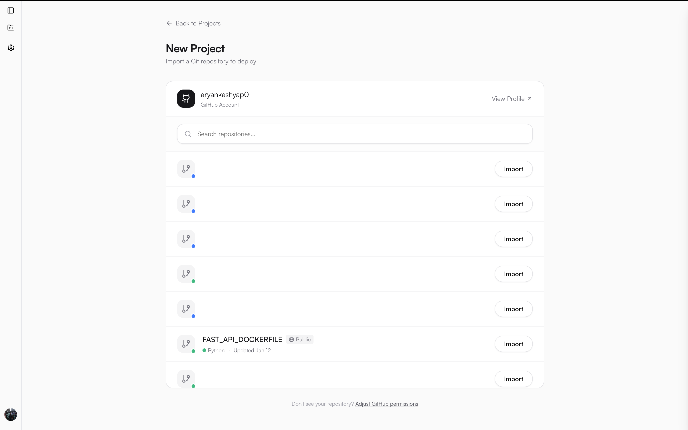
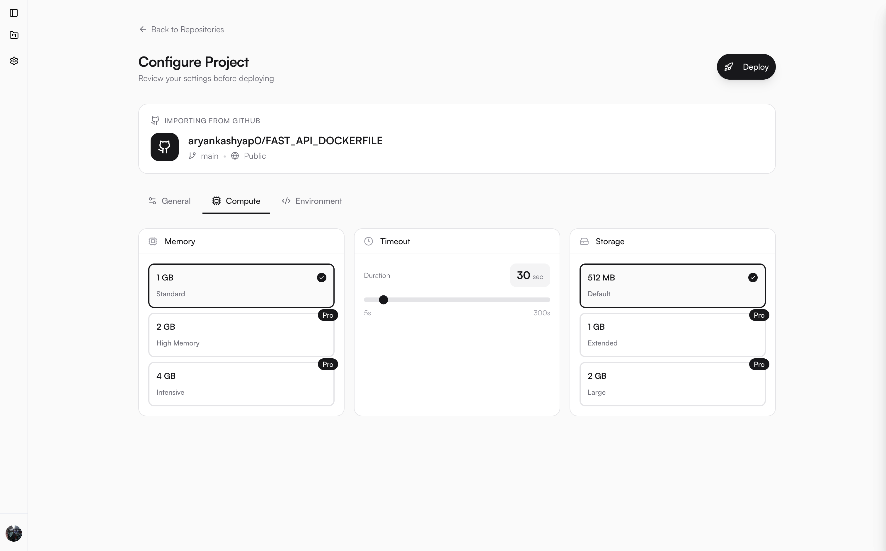
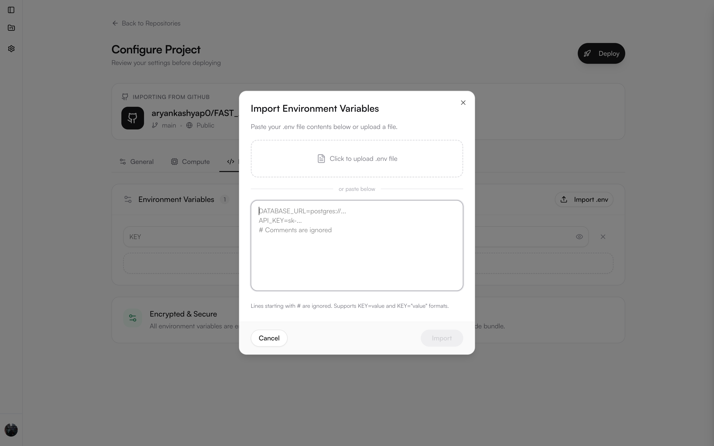

<div align="center">


<p>
  
  
  
  
</p>

<h3>Vercel for the backend.</h3>

<p>Deploy, manage, and scale backend applications without worrying about infrastructure.</p>

<p>
  <a href="https://shorlabs.com"><strong>Website</strong></a>
</p>

</div>

---

## 📖 What is Shorlabs?

Shorlabs is a platform for deploying, managing, and scaling backend applications built with Python or Node.js—so developers never have to worry about provisioning or maintaining infrastructure.

It is built primarily on **AWS Lambda**, which means you only pay for what you use while benefiting from automatic scalability by default, along with a generous free tier.

<p align="center">
  
</p>

---

## ✨ Features

| Feature | Description |
|---------|-------------|
| **One-Click Deployment** | Connect your GitHub repository and deploy with a single click. No Docker knowledge required. |
| **Automatic Runtime Detection** | Shorlabs automatically detects Python or Node.js projects and configures the build accordingly. |
| **Custom Subdomains** | Every project gets a unique `project-name.shorlabs.com` subdomain, instantly accessible. |
| **Environment Variables** | Securely configure environment variables through the dashboard. Supports `.env` file imports. |
| **Configurable Compute** | Choose memory (1 GB, 2 GB, 4 GB), timeout (up to 300s), and ephemeral storage (512 MB, 1 GB, 2 GB). |
| **Deployment History** | Track every deployment with status, build logs, and timestamps. |
| **Runtime Logs** | View real-time CloudWatch logs directly from the dashboard. |
| **GitHub OAuth** | Seamless authentication with GitHub for repository access. |
| **Pay-Per-Use Pricing** | Built on AWS Lambda, so you only pay for actual compute time. |

---

## 🚀 Getting Started

### Prerequisites

- [Node.js](https://nodejs.org/) v18+ (for frontend)
- [Python](https://python.org/) 3.12+ (for backend)
- [Bun](https://bun.sh/) (recommended) or npm
- [Docker](https://docker.com/) (for building container images)
- [AWS CLI](https://aws.amazon.com/cli/) configured with credentials
- **AWS IAM User** with the policy from [`shorlabs-deployment-policy.json`](apps/backend/shorlabs-deployment-policy.json)

> **Note:** The IAM policy grants access to ECR, Lambda, IAM, S3, CloudWatch, CodeBuild, DynamoDB, SQS, CloudFront, and EventBridge. Create an IAM user with this policy and configure your AWS CLI credentials before deploying.

### 1. Clone the Repository

```bash
git clone https://github.com/yourusername/shorlabs.git
cd shorlabs
```

### 2. Install Dependencies

```bash
# Install frontend dependencies (from root)
bun install

# Install backend dependencies
cd apps/backend
python -m venv venv
source venv/bin/activate  # On Windows: venv\Scripts\activate
pip install -r requirements.txt
```

### 3. Configure Environment Variables

**Frontend** (`apps/frontend/.env.local`):

```env
# Clerk Authentication
NEXT_PUBLIC_CLERK_PUBLISHABLE_KEY=your_clerk_publishable_key
CLERK_SECRET_KEY=your_clerk_secret_key
NEXT_PUBLIC_CLERK_AFTER_SIGN_IN_URL=/projects
NEXT_PUBLIC_CLERK_AFTER_SIGN_UP_URL=/projects

# Backend API URL
NEXT_PUBLIC_API_URL=http://localhost:8000
```

**Backend** (`apps/backend/.env`):

```env
# AWS Credentials
AWS_ACCESS_KEY_ID=your_aws_access_key
AWS_SECRET_ACCESS_KEY=your_aws_secret_key
AWS_DEFAULT_REGION=us-east-1

# Clerk Authentication
CLERK_SECRET_KEY=your_clerk_secret_key
CLERK_ISSUER=https://your-clerk-instance.clerk.accounts.dev

# Frontend URL (for CORS)
FRONTEND_URL=http://localhost:3000
```

### 4. Run Locally

**Start the Backend:**

```bash
cd apps/backend
source venv/bin/activate
uvicorn api.main:app --reload --port 8000
```

**Start the Frontend (in a new terminal):**

```bash
# From the root directory
bun run dev
```

The app will be available at `http://localhost:3000`.

### 5. Deploy the Platform to AWS

Shorlabs requires three infrastructure components to be deployed. Run these scripts from `apps/backend/`:

#### 5.1 Deploy the Core API

```bash
cd apps/backend
./deploy-lambda.sh
```

This script deploys the Shorlabs backend API and sets up:
- **ECR Repository** — Container registry for the backend Docker image
- **Lambda Function** — The main API with Lambda Web Adapter
- **SQS Queues** — FIFO queue for background deployment tasks + Dead Letter Queue
- **Function URL** — Public HTTPS endpoint for the API
- **IAM Roles** — Permissions for Lambda, DynamoDB, ECR, CodeBuild, SQS

After deployment, note the **Function URL** — you'll update `NEXT_PUBLIC_API_URL` with this.

#### 5.2 Set Up Wildcard Subdomain Routing

```bash
./setup_wildcard_routing.sh
```

This script enables custom subdomains (`*.shorlabs.com`) for user projects:
- **Lambda@Edge Function** — Routes subdomains to the correct user Lambda
- **CloudFront Distribution** — CDN with SSL for all subdomains
- **DNS Configuration** — Route 53 or manual CNAME setup for `*.yourdomain.com`

> **Note:** Requires an ACM certificate for `*.yourdomain.com` in `us-east-1`.

#### 5.3 Schedule Usage Metrics Aggregation

```bash
./schedule_usage_aggregator.sh
```

This script configures automated usage tracking:
- **EventBridge Rule** — Hourly cron trigger
- **Usage Aggregator** — Fetches CloudWatch metrics and stores in DynamoDB

---

### 6. Deploy the Frontend

Deploy the Next.js frontend to [Vercel](https://vercel.com) or your preferred host:

```bash
cd apps/frontend
bun run build
```

Set these environment variables in your hosting platform:
- `NEXT_PUBLIC_CLERK_PUBLISHABLE_KEY`
- `CLERK_SECRET_KEY`
- `NEXT_PUBLIC_API_URL` (your Lambda Function URL from step 5.1)

---

## 📋 Workflow

<p align="center">
  
</p>

<p align="center">
  <em>Step 1 — Connect your GitHub account and import an existing repository to get started.</em>
</p>

<br/>

<p align="center">
  
</p>

<p align="center">
  <em>Step 2 — Configure your project settings, including name, root directory, and start command.</em>
</p>

<br/>

<p align="center">
  
</p>

<p align="center">
  <em>Step 3 — Choose compute resources such as memory, timeout, and storage based on your workload.</em>
</p>

<br/>

<p align="center">
  
</p>

<p align="center">
  <em>Step 4 — Add environment variables securely, then deploy with a single click.</em>
</p>

---

## 💡 Why Shorlabs Exists

Shorlabs is born out of frustration. I've built many applications, and the backend was almost always painful to deploy and manage—while the frontend, on platforms like Vercel, felt effortless. I wanted that same simplicity for backend services: connect a GitHub repository and have everything else handled automatically.

Many developers still believe complex backends require long-running servers or containers, and that Function-as-a-Service platforms like AWS Lambda are only for simple, stateless tasks. That belief is outdated. Modern backends can run reliably on FaaS with far better economics. The real barrier isn't technical—it's tooling. Shorlabs exists to remove that barrier.

---

## 🛠️ Tech Stack

| Layer                    | Technology                                      |
|--------------------------|-------------------------------------------------|
| **Frontend**             | Next.js 16, React 19, TypeScript               |
| **UI Components**        | Radix UI, Tailwind CSS 4, Lucide Icons         |
| **Authentication**       | Clerk (GitHub OAuth)                           |
| **Backend API**          | Python, FastAPI, Mangum (Lambda adapter)       |
| **Database**             | DynamoDB (Single-table design)                  |
| **Deployment Runtime**   | AWS Lambda (Function URLs + Lambda@Edge)       |
| **Container Registry**   | Amazon ECR                                     |
| **Build System**         | AWS CodeBuild (Docker-based)                   |
| **Routing**              | Lambda@Edge (Wildcard subdomain routing)       |
| **Monitoring**           | CloudWatch Logs & Metrics                      |
| **Queue System**         | Amazon SQS (Background deployment tasks)       |
| **Scheduling**           | EventBridge (Usage aggregation)                |
| **Infrastructure**       | AWS SDK (boto3), IAM Roles & Policies          |


## 📞 Support

For questions, issues, or support, please contact me via email at **kashyaparyan093@gmail.com**.

---

## 🤝 Contributing

Shorlabs is currently in alpha. Contributions are welcome, but please open an issue first to discuss any major changes before submitting a pull request.

---

## 📄 License

This project is licensed under the Apache 2.0 License. See the [LICENSE.md](LICENSE.md) file for more information.

